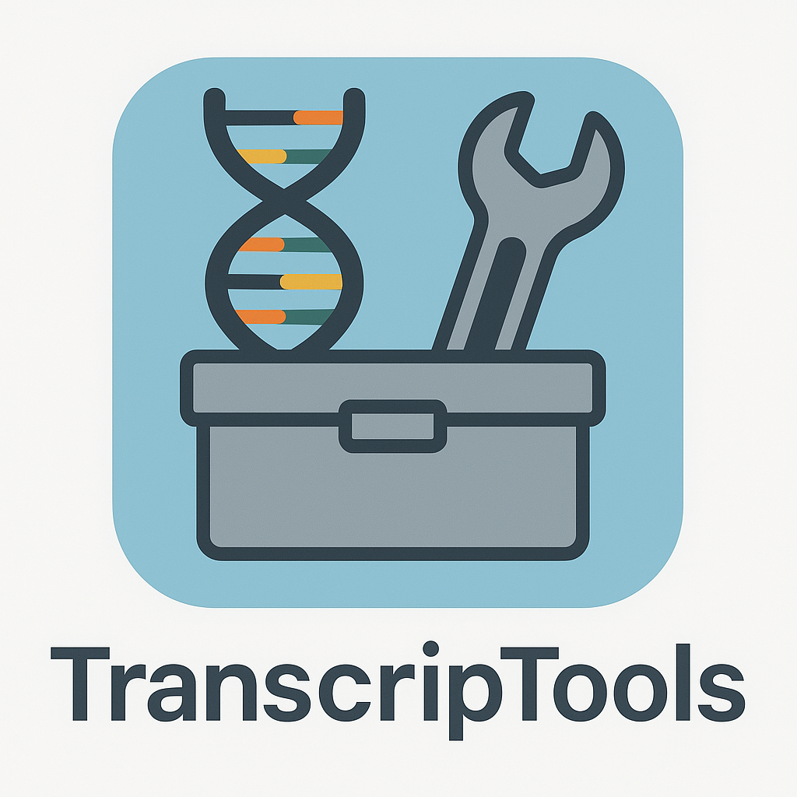

# TranscriptTools

`TranscripTools` is an R package designed to streamline bulk RNA-seq analysis by providing convenient functions for commonly used tasks such as PCA, heatmaps, and other exploratory and visualization techniques.
The package aims to reduce repetitive coding, improve workflow efficiency, and make RNA-seq data exploration more accessible.

As `TranscripTools` is under active development, and new features are being added. Users are welcome to explore, test, and provide feedback.

Open to collaborations to further improve the package!
